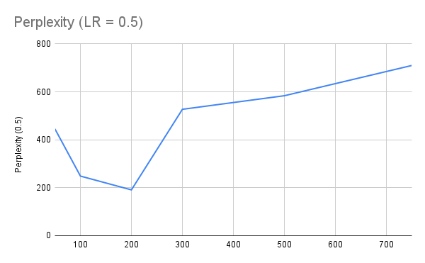
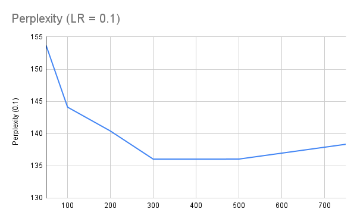
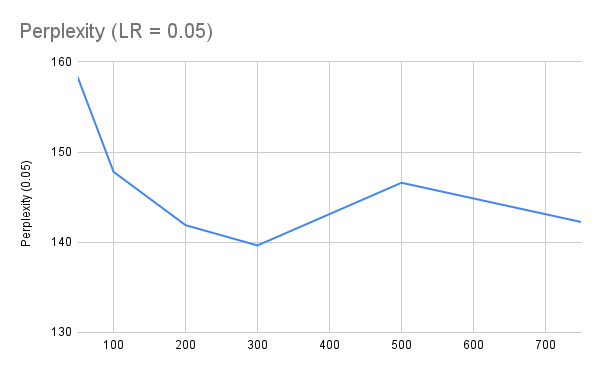

# Part 1
## Loading the Model
The model can be found [**here**](https://drive.google.com/drive/folders/1dZixpnOqfwK0XG9wr7tRYsgPi6TWv1Ya?usp=sharing). It can be loaded by executing
```
lm = torch.load('lm1.pth')
```

## Perplexities
The perplexities on each sentence can be found [**here**](https://drive.google.com/drive/folders/1dZixpnOqfwK0XG9wr7tRYsgPi6TWv1Ya?usp=sharing).

The model achieves average perplexities 3947.596170453033 and 3668.774925535509 on the train and test sets respectively.

This is achieved after approximately 12-13 epochs of training on early stopping (see below).

## Hyperparameter Tuning
The model was tuned over learning rates and hidden sizes. The training was stopped as soon as the perplexity began to rise, and the model that achieves the lowest perplexity is saved.

The minimum perplexity achieved in each setting is as follows.

| LR | Hidden Size | Perplexity |
| :---: | :---: | :---: |
| 0.5   | 50   | 445.4151784118655 |
| 0.5   | 100  | 248.5735133989294 |
| 0.5   | 200  | 191.03992177058632 |
| 0.5   | 300  | 527.1333332906837 |
| 0.5   | 500  | 583.807669173427 |
| 0.5   | 750  | 710.0080163726197 |
| 0.1   | 50   | 153.66330475593168 |
| 0.1   | 100  | 144.10166826986008 |
| 0.1   | 200  | 140.3987062715083 |
| 0.1   | 300  | 136.03800565161816 |
| 0.1   | 500  | 136.04324240083798 |
| 0.1   | 750  | 138.34370843422144 |
| 0.05  | 50   | 158.3604658900976 |
| 0.05  | 100  | 147.81110492160553 |
| 0.05  | 200  | 141.89768446765333 |
| 0.05  | 300  | 139.64762862918073 |
| 0.05  | 500  | 146.6020028351067 |
| 0.05  | 750  | 142.24269077439146 |





These show that a lower learning rate requires higher hidden sizes to learn enough.

# Part 2
## Loading the Model
The model can be found [**here**](https://drive.google.com/file/d/1czaUck9fLEJ_k1i7q9UlgCpPQHN_Y0Jj/view?usp=sharing). It can be loaded by executing
```
lm = torch.load('lm2.pth')
```

## Perplexities
The perplexities on each sentence can be found [**here**](https://drive.google.com/drive/folders/1dZixpnOqfwK0XG9wr7tRYsgPi6TWv1Ya?usp=sharing).

The model achieves perplexities of 349.0280224156846 and 349.3744377604406 on the train and test sets respectively.

This is achieved after 5 epochs of training.

# Analysis
Clearly, the RNN model is far superior to the feedforward model, achieving more than 10x better results. This is expected, given that it makes use of more context (arbitrary-length input).

We also see that it takes fewer epochs (5 as compared to 12) for the RNN to achieve these results.
